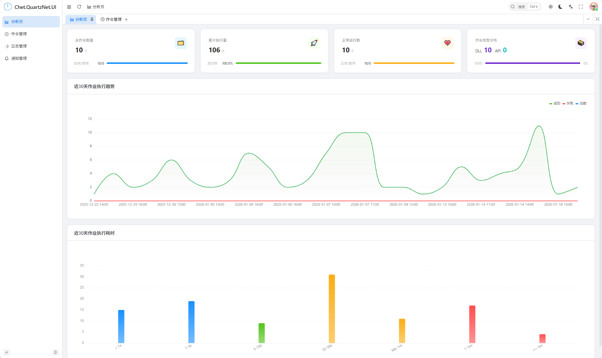
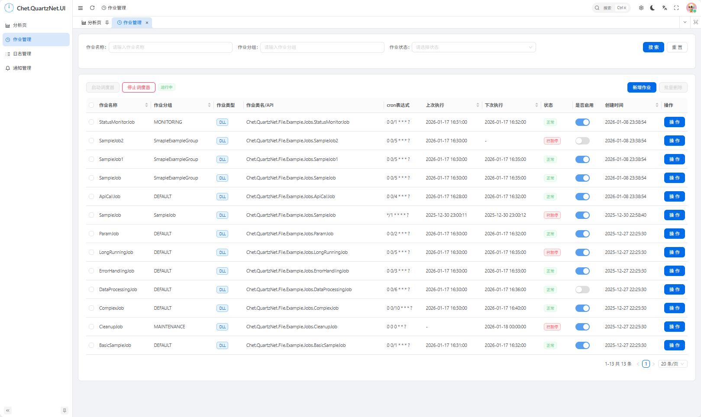
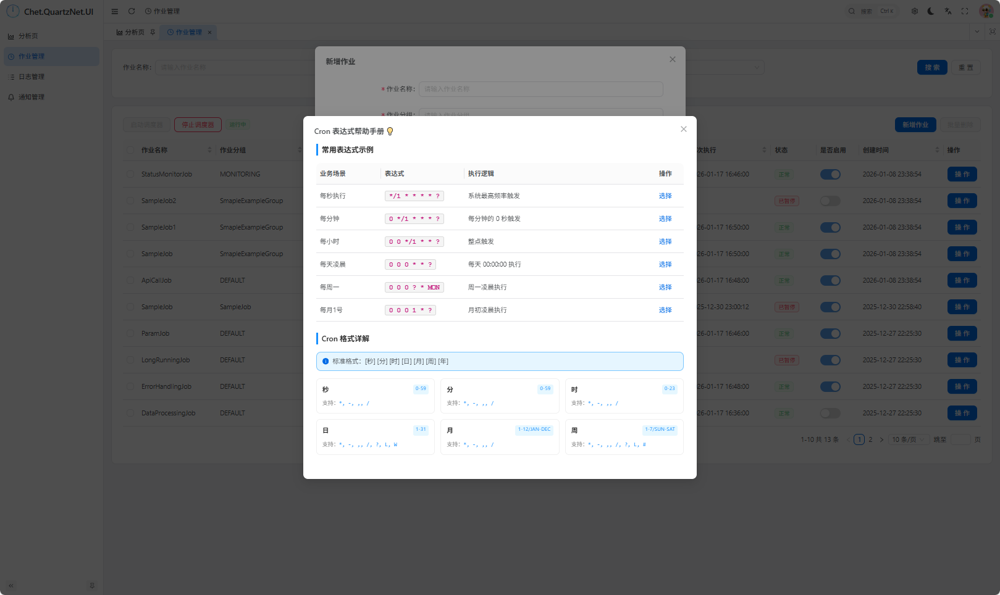
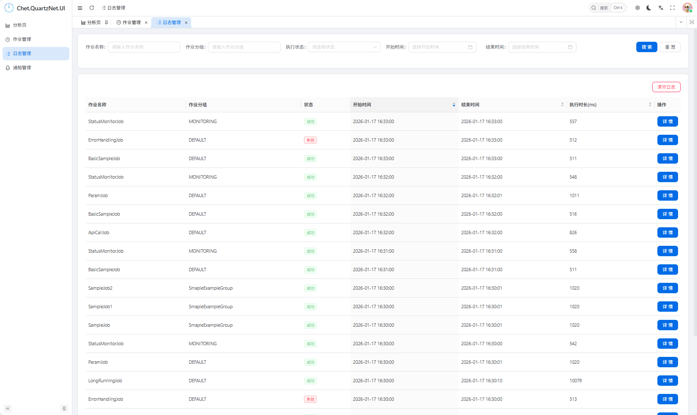
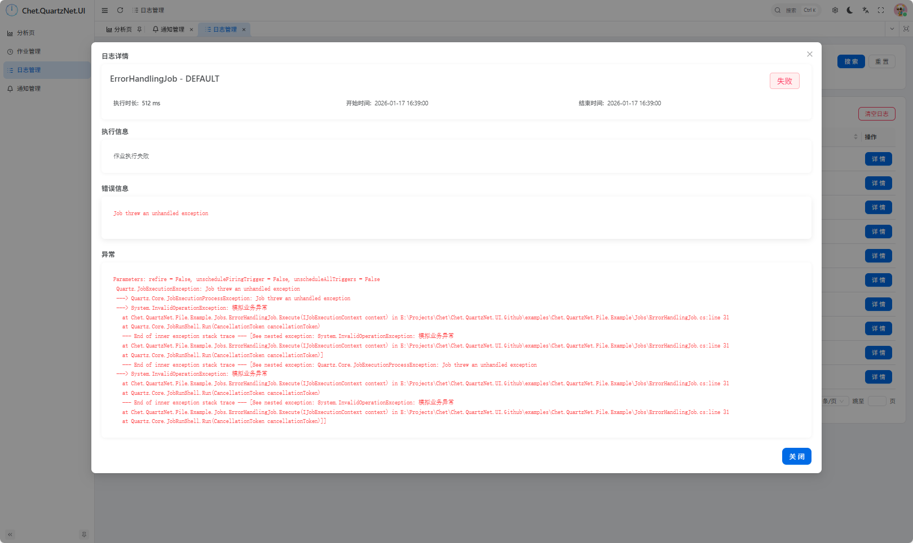
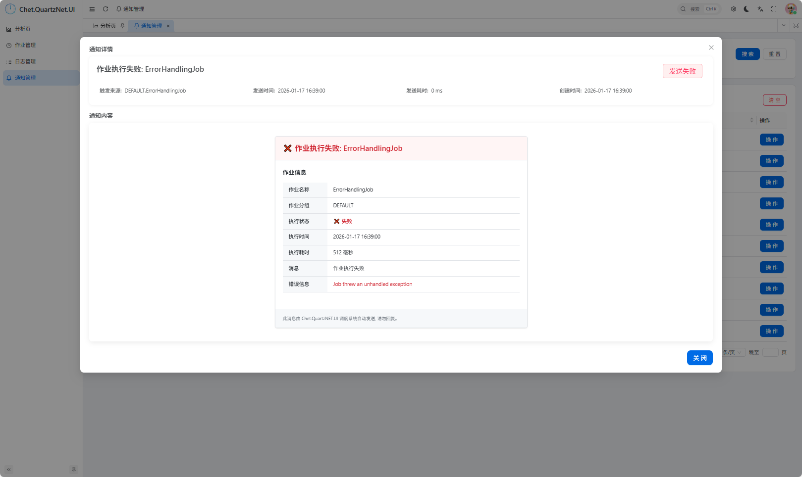

# 🔥 Chet.QuartzNet.UI 分析页重构，数据可视化体验升级！

## 🎯 为什么要重构分析页？

之前的分析页虽然能展示数据，但界面不够直观，数据展示形式单一，用户体验有待提升。为了让开发者能更清晰、更高效地了解作业执行情况，我们对分析页进行了全面重构！😍

## ✨ 重构后有哪些令人惊艳的变化？

### 📊 全新数据可视化，趋势一目了然
- **统计卡片**: 展示作业数量、运行中情况等关键指标，一目了然
- **折线图**：展示作业执行成功率趋势，让你一眼看出系统稳定性
- **柱状图**：直观展示作业执行耗时情况，帮助你快速定位耗时作业

### 🎨 现代化UI设计，视觉体验升级
- 采用全新的卡片式布局，信息层次更清晰
- 响应式设计，适配不同屏幕尺寸
- 流畅的动画效果，交互体验更丝滑
- 浅色暗色主题更符合用户习惯，在不同环境下都有好的显示效果


## 📸 界面展示















## 🚀 如何体验全新分析页？

### 1️⃣ 更新到最新版本

```bash
dotnet add package Chet.QuartzNet.UI --version 最新版本号
```

### 2️⃣ 启动应用

启动你的应用后，访问 `http://localhost:port/quartz-ui` 进入管理界面，点击左侧菜单的「分析」即可体验全新的分析页！

想了解更多功能详情，可以查看 [1、推荐一款超好用的 .NET 可视化任务调度神器](https://github.com/qiect/Chet.QuartzNet.UI/blob/main/README.md)。

## 💡 使用技巧

### 🎯 快速定位问题作业
1. 使用状态筛选，只看失败的作业
2. 查看失败率高的作业组
3. 分析失败作业的执行时间和频率

### 📈 优化作业调度策略
1. 查看作业执行时间分布图
2. 避免在高负载时间段调度大量作业
3. 合理设置作业执行间隔

### 🔧 提升系统性能
1. 查看作业平均执行时间
2. 优化执行时间过长的作业
3. 考虑拆分复杂作业为多个简单作业

## 🎉 总结

这次分析页重构，我们不仅提升了界面美观度，更重要的是增强了数据可视化能力和用户体验。全新的分析页将帮助你更高效地监控和管理作业，及时发现问题，优化系统性能！

如果你对新功能有任何建议或反馈，欢迎在GitHub上提出Issue或提交PR，我们期待你的参与！😊

---

**项目地址**：[https://github.com/qiect/Chet.QuartzNet.UI](https://github.com/qiect/Chet.QuartzNet.UI)
**NuGet包**：[https://www.nuget.org/packages/Chet.QuartzNet.UI](https://www.nuget.org/packages/Chet.QuartzNet.UI)